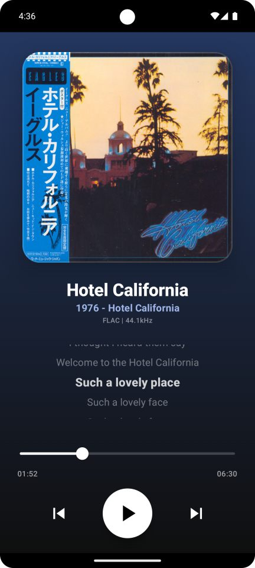
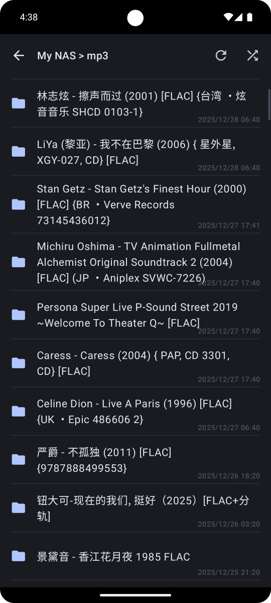
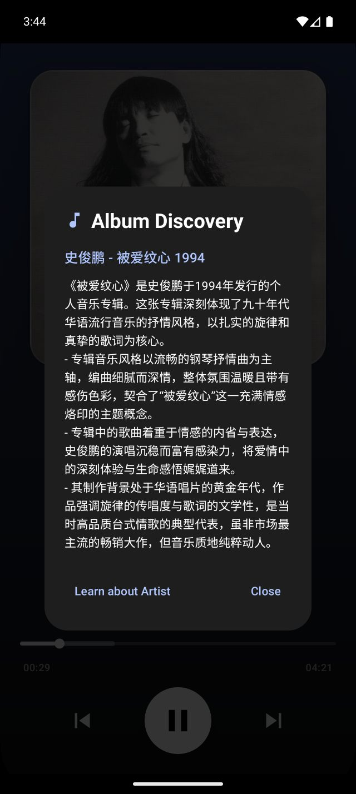

# Folder Player

一个专为本地及云端音频收藏设计的极简、美观且功能强大的 Android 文件夹音乐播放器。

         
---

## 核心特性

- **📂 深度文件夹浏览**：直接按目录播放音乐，支持常见的MP3/FLAC/OGG/M4A/AAC/WAV等格式，无需复杂的媒体库扫描，原生支持WebDAV (Alist/NAS)与本地存储 。
- **🚀 AI实时鉴赏专辑**：支持对专辑及歌手的AI检索，需配置LLM API。
- **📜 全方位歌词体验**：支持本地 `.lrc` 文件、音频内嵌歌词（ID3 Tags）以及自定义歌词 API 接口（已预置，感谢 https://github.com/HisAtri/LrcApi 项目）。
- **📑 CUE 整轨支持**：完美解析 `.cue` 文件，支持 FLAC/WAV 的虚拟分轨播放。
- **🎨 现代极致设计**：深色主题，自动显示文件夹内的封面图片，支持音乐文件内嵌封面，支持封面显示大小切换，界面精致、动画流畅。
- **🎧 智能交互**：
    - 耳机断开自动暂停。
    - 记忆任意文件夹上一次的排序规则。
    - 支持源管理及排序。
    - 支持多播放列表的管理。
    - 支持两种模式的播放倒计时。
    - 支持文件/文件夹修改日期显示。

## 操作说明

### 1. 基础导航
- App 采用三屏滑动设计：**[播放页] <-> [文件浏览器] <-> [设置]**。
- 您可以左右滑动屏幕快速切换。
- 在播放界面上划可呼出播放列表。
- 双击歌词区域可按瀑布流查看歌词。
- 在播放界面点击专辑/文件夹名称可利用AI大模型介绍该专辑。

### 2. 文件播放
- **单曲播放**：在浏览器中点击任意音频文件即可开始播放当前文件夹。
- **整轨/CUE 播放**：点击 `.cue` 文件，App 会自动解析并显示分轨列表。
- **播放列表播放**：在播放列表中创建新的列表，在文件浏览器中长按文件夹或文件可添加到列表中。
- **随机播放**：在文件夹内点击顶部的“随机播放”图标，将随机打乱当前目录下的所有歌曲。

### 3. 播放列表控制按钮
- 在播放页点击右上角图标呼出播放列表，右侧可看到 **“定时器”** 按钮及 **“无限播放”** 按钮。
- **定时器开启后**：可按分钟数或歌曲数进行倒计时，到点后暂停播放。
- **无限按钮开启后**：当前文件夹播放完毕，App 会自动寻找并开始播放下一个目录，实现真正的“无限”畅听。
- 此外还有常用的循环播放及随机播放按钮。

### 4. 智能排序
- **默认排序**：在 [设置] 页面中，您可以配置全局默认的排序方式（按名称、日期或大小）。
- **个性化记忆**：在任何文件夹内手动切换排序方式（点击标题栏的排序图标）后，App 会**自动记住该路径的专属排序方式**，下次进入时将自动应用。

### 5. 源管理 (WebDAV/NAS)
- 在浏览器主界面（Root），点击 **"Add WebDAV"**。
- 输入您的服务器地址、路径、用户名及密码。
- **排序/删除**：点击源右侧的展开图标，可以进行 **"Move Up/Down"** 排序或 **"Delete"** 删除。

### 6. 设置项
- **封面大小**：支持切换 Standard（标准）与 Large（大封面）模式。
- **歌词 API**：可手动配置在线歌词接口地址。
- **ChatGPT API**：可手动配置各种AI大模型的API KEY，用于深度理解专辑/歌手的背景。

---

# Folder Player (English)

A minimalist, beautiful, and powerful Android folder-based music player designed for both local and cloud audio collections.

         

---

## Core Features

- **📂 Deep Folder Browsing**: Play music directly by directory, supporting common formats like MP3, FLAC, OGG, M4A, AAC, WAV, etc. No complex library scanning required. Native support for WebDAV (Alist/NAS) and local storage.
- **🚀 AI Real-time Album Insight**: Supports AI-powered retrieval for albums and artists (requires LLM API configuration).
- **📜 Comprehensive Lyrics**: Supports local `.lrc` files, embedded ID3 tag lyrics, and custom online Lyric API integration (Pre-configured, credits to the [LrcApi](https://github.com/HisAtri/LrcApi) project).
- **📑 CUE Sheet Support**: Perfectly parses `.cue` files, supporting virtual track splitting for FLAC/WAV.
- **🎨 Premium Modern Design**: Dark theme with auto-detection of folder cover art. Supports embedded covers and configurable cover display sizes. Refined interface with smooth animations.
- **🎧 Intelligent Interaction**:
    - Auto-pause when headphones are disconnected.
    - Path-specific sorting memory for every folder.
    - Source management and reordering.
    - Multi-playlist management.
    - Two-mode playback sleep timer.
    - File/Folder modification date display.

## Usage Instructions

### 1. Basic Navigation
- The app features a three-screen pager: **[Player] <-> [File Browser] <-> [Settings]**.
- Swipe horizontally to switch screens quickly.
- Swipe up on the Player screen to toggle the playlist.
- Double-tap the lyrics area to view lyrics in a waterfall flow.
- Tap the album or folder name on the Player screen to use AI for an in-depth introduction to the album.

### 2. Playback
- **Single Track**: Tap any audio file in the browser to start playing from that specific song within the folder.
- **CUE Sheets**: Tap a `.cue` file to parse and play split tracks automatically.
- **Playlist Playback**: Create new lists in the playlist view; long-press a file or folder in the browser to add it to a list.
- **Shuffle**: Use the "Shuffle" icon at the top of a folder to play all contents in random order.

### 3. Playlist Control Buttons
- Tap the icon in the top right of the Player screen to call up the playlist, where you will find the **"Timer"** and **"Infinite"** buttons.
- **Sleep Timer**: Configure a countdown by minutes or number of songs. Playback pauses when reached.
- **Infinite Button**: When enabled, the app automatically finds and plays the next directory once the current one finishes, providing truly uninterrupted listening.
- Standard loop and shuffle controls are also available here.

### 4. Intelligent Sorting
- **Default Sort**: Configure global default sorting (By Name, Date, or Size) in the [Settings] screen.
- **Path-Specific Memory**: Manually changing the sort order (via the sort icon in the header) in any folder will be **automatically remembered** for that specific path.

### 5. Source Management (WebDAV/NAS)
- On the browser root screen, tap **"Add WebDAV"**.
- Enter your server URL, path, and credentials.
- **Management**: Expand a source item to access **"Move Up/Down"** for reordering or **"Delete"** to remove.

### 6. Settings
- **Cover Size**: Toggle between Standard and Large cover display modes.
- **Lyric API**: Configure a custom URL for online lyric fetching.
- **ChatGPT API**: Manually configure API keys for various AI models to gain deep insights into albums and artists.
